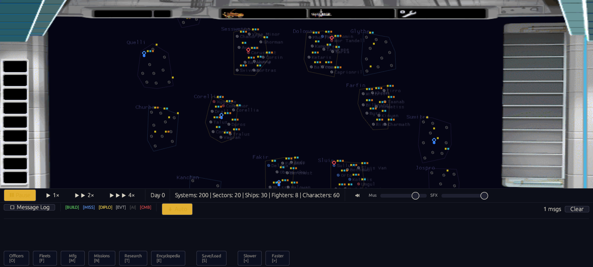
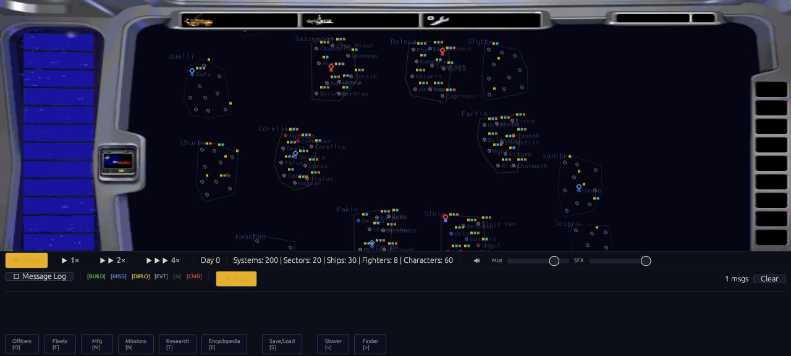

# F-007B Fleet Position and Consolidation Evidence

F-007B closes two more causes of F-007's runaway fleet behavior. Active
movement orders now own in-transit position, completed production attaches
only to an orbiting fleet, and compatible arrivals consolidate instead of
leaving an unbounded arena of one-ship fleets. System-level combat, ordinary
player fleet dispatch, transit balance, and victory remain open.

## Implemented invariants

- An accepted departure removes the fleet from its origin's `System.fleets`
  orbit index. A rejected order changes nothing.
- `MovementState` is authoritative during transit. Before economy and
  manufacturing run, stale save/index membership is rebuilt deterministically.
- Arrival uses one helper in the interactive and headless paths. Anonymous
  same-faction fleets merge into the lowest stable `FleetKey`; capital-ship
  damage and fighter counts are preserved.
- Fleets with characters or a Death Star remain distinct, preserving
  player-significant task forces.
- Production cannot attach ships or fighters to a fleet that is in transit.
- Transit fleets no longer reveal or scan from their stale origin through fog
  of war.

## Five-seed campaign evidence

Each seed ran dual AI for 5,000 ticks against the original 200-system data.
All runs completed without panic.

| Seed | Initial fleets | Final fleets | Transit | Moves | Arrivals | Moves/arrival | Space battles | Battle systems | Top system | Victory |
|---:|---:|---:|---:|---:|---:|---:|---:|---:|---:|---|
| 7 | 7 | 6 | 4 | 2,559 | 2,555 | 1.0016 | 584 | 1 | 584 | No |
| 42 | 5 | 7 | 5 | 2,721 | 2,716 | 1.0018 | 603 | 2 | 602 | No |
| 99 | 8 | 4 | 4 | 3,243 | 3,239 | 1.0012 | 0 | 0 | 0 | No |
| 1,337 | 7 | 7 | 5 | 2,767 | 2,762 | 1.0018 | 601 | 2 | 600 | No |
| 424,242 | 8 | 8 | 5 | 2,881 | 2,876 | 1.0017 | 883 | 2 | 882 | No |

The final fleet arena is at most 1.4 times its initial size and every
move/arrival ratio is at most 1.002, both inside the M1 bounds. Seed 42 improves
from F-007A as follows:

| Metric | After F-007A | After F-007B | Reduction |
|---|---:|---:|---:|
| Semantic events | 1,782,261 | 215,703 | 87.9% |
| Attack orders | 78,946 | 2,098 | 97.3% |
| Accepted moves | 153,462 | 2,721 | 98.2% |
| Arrivals | 152,513 | 2,716 | 98.2% |
| Final fleet records | 950 | 7 | 99.3% |
| Fleets in transit | 949 | 5 | 99.5% |

Two independent seed-42 runs produced the same 215,703 semantic events. After
removing `wall_ms` and sorting JSON keys, both streams have SHA-256
`2a99868cb055063dea648a6ce4bd79c2a4946d2808e77ca8b3a80aa4b2f90296`.
The quality evaluator reports non-degenerate output with score `0.3420`.

## Automated and replay verification

| Gate | Result |
|---|---|
| Focused position, merge, production, and fog regressions | 6 passed |
| Astra simultaneous-arrival conservation probes | 5 passed |
| Workspace unit tests | 530 passed, 0 failed, 4 intentionally ignored |
| Doctests | 3 passed, 0 failed, 16 intentionally ignored |
| Original-data replay test | 5 fresh processes passed |
| Native/WASM replay | 9 of 9 checkpoints matched |
| Replay artifact | 13,482 bytes, SHA-256 `d65099c51cb87a139667529cf61a237f34ba0b114138b7cb59d832777e72c71e` |
| Final replay fingerprint | `v1:b8a40a56246c1314` at tick 25 |
| WASM | 4,950,051 bytes, SHA-256 `4af91b553fe9ffc327b914ea070b92623f19dc94c862a4d410bb05d2daee6987` |
| Runtime pack | 29,096,058 bytes, SHA-256 `6123deec14cfbfd070573c7001ef1123bd52067273498ad0c36cb7fdb108f509` |

## Browser and bitmap verification

GPT-6 Astra at medium effort independently reviewed the implementation and
returned PASS with no new P0-P2 defect. It ran the packaged replay gate,
visually checked the main menu and both faction cockpits, and confirmed:

- four HTTP 200 requests per normal faction startup;
- a nonblank bitmap galaxy and faction-specific cockpit;
- zero page, console, network, or missing-asset errors; and
- music disabled during the final checks.

## Remaining M1 failures

This tranche does not close F-007 or M1. Final transit share ranges from 62.5%
to 100%, above the 10% gate. Four seeds exceed the 400-battle ceiling while
seed 99 produces none. At most two systems see combat, one system owns nearly
every battle, and no seed reaches victory. The next steps are:

1. wire ordinary player fleet dispatch to the shared departure helper;
2. resolve opposing fleets at system scope instead of one pair per cooldown;
3. diversify combat targets and correct persistent transit churn; and
4. enable and verify the Death Star and victory paths.
