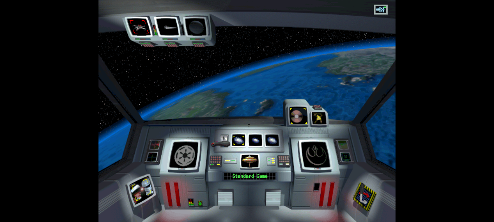

# F-007A Fleet Redispatch Evidence

F-007A closes the first root cause inside the broader F-007 runaway-fleet
finding. A fleet with an active hyperspace order can no longer receive a
replacement order until it arrives or the order is explicitly cancelled.

## Enforced invariant

- `MovementState::order` rejects a second order and preserves the original
  origin, destination, duration, and elapsed ticks.
- AI deployment omits fleets already in transit.
- A fleet reserved by an earlier AI heuristic cannot receive another move
  action in the same evaluation.
- AI telemetry, movement messages, and departure audio are emitted only for
  accepted movement orders. A rejected player command retains accurate
  "already in transit" feedback without announcing a departure.

The behavior is covered by four focused regressions: active-order state
preservation, in-transit AI exclusion, same-evaluation action deconfliction,
and one accepted order/event when a batch contains two moves for the same
fleet.

## Seed-42 measurement

The current headless runner was built and exercised with:

```bash
./target/debug/rebellion-playtest data/base \
  --seed 42 --ticks 5000 --dual-ai \
  --output /tmp/open-rebellion-f007a-seed42.jsonl --summary
```

| Metric | Audit baseline | After F-007A |
|---|---:|---:|
| Total events | 2,001,963 | 1,782,261 |
| AI attack orders | 306,012 | 78,946 |
| All accepted fleet moves | not recorded | 153,462 |
| Fleet arrivals | not recorded | 152,513 |
| Accepted moves per arrival | not recorded | 1.006 |
| Fleet arena | 985 inferred | 950 |
| Fleets in transit at tick 5,000 | 980 | 949 |
| Space battles | not recorded | 7 |
| Victory | none | none |

The accepted-move/arrival ratio now satisfies the M1 ceiling of 1.5 for this
seed, and attack-order volume fell by 74.2%. This does not close F-007: 949 of
950 fleets are still in transit, fleet count remains 190 times the five-fleet
start, combat is sparse, and no victory occurs. Those results isolate the next
work to production attachment, explicit fleet position, arrival merging, and
system-scoped combat backlog handling.

## Verification

- Focused regressions: 4 passed, 0 failed.
- Seed 42: 5,000 ticks completed deterministically without a panic.
- Game-quality evaluator: non-degenerate, score `0.3871`.
- Workspace: 524 unit tests and 3 doc tests passed, 0 failed; 4 unit and 16 doc
  tests remain intentionally ignored.
- Independent seed-42 runs produced the same 1,782,261 semantic events after
  excluding wall-clock timing. Semantic SHA-256:
  `80a168d5e9238ec1fcc056b696a06622171b576af2d6f80fffd189d1e25f6806`.
- The packaged WASM build passed at 4,934,894 bytes, SHA-256
  `04e5137b4b4be2bd14b6ef2d2748a21bf118cf0e36e35a97e59f4f83fd0175d7`.
- The runtime pack remained 29,096,058 bytes, SHA-256
  `6123deec14cfbfd070573c7001ef1123bd52067273498ad0c36cb7fdb108f509`.
- The reviewed 13,482-byte replay artifact retained its commands and initial
  state. Its intentionally changed tick-15 onward checkpoints now end at
  `v1:8fbffe578f9319e4`; the ignored original-data fixture and native/WASM
  equivalence gate both pass with four requests and zero browser errors.
- Codex Orchestrator with GPT-6 Astra at medium effort passed clean Alliance
  and Empire browser sessions. Each loaded the bitmap cockpit and
  faction-specific bitmap galaxy through exactly four HTTP 200 requests, with
  zero console, page, request, or missing-asset errors. Music remained muted
  during interaction testing.
- Astra's final read-only pass reproduced the 524 unit tests, 3 doc tests, both
  original-data fixture tests, five identical native replay processes, and the
  native/WASM browser gate. It found no P0-P2 defect in F-007A.


