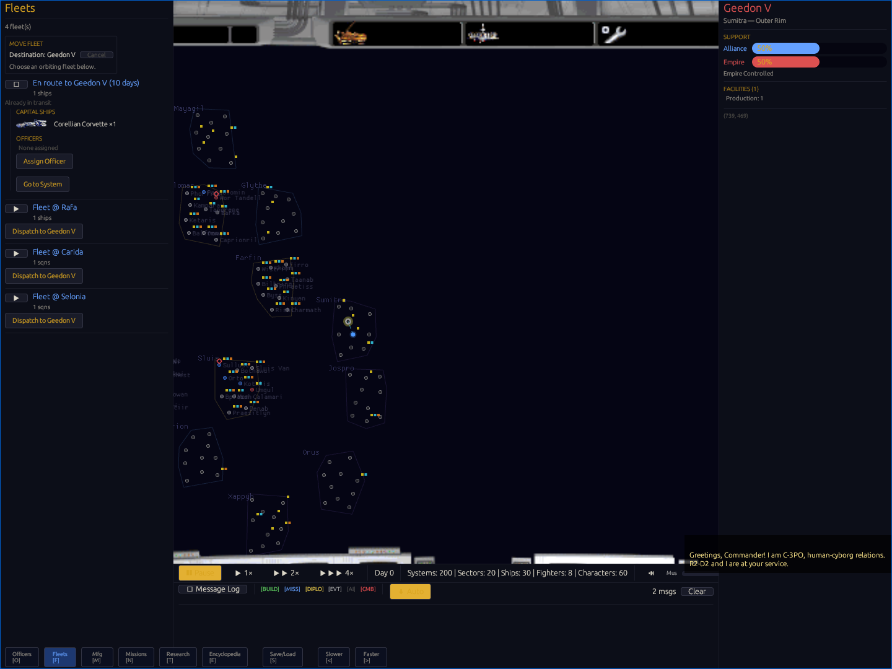
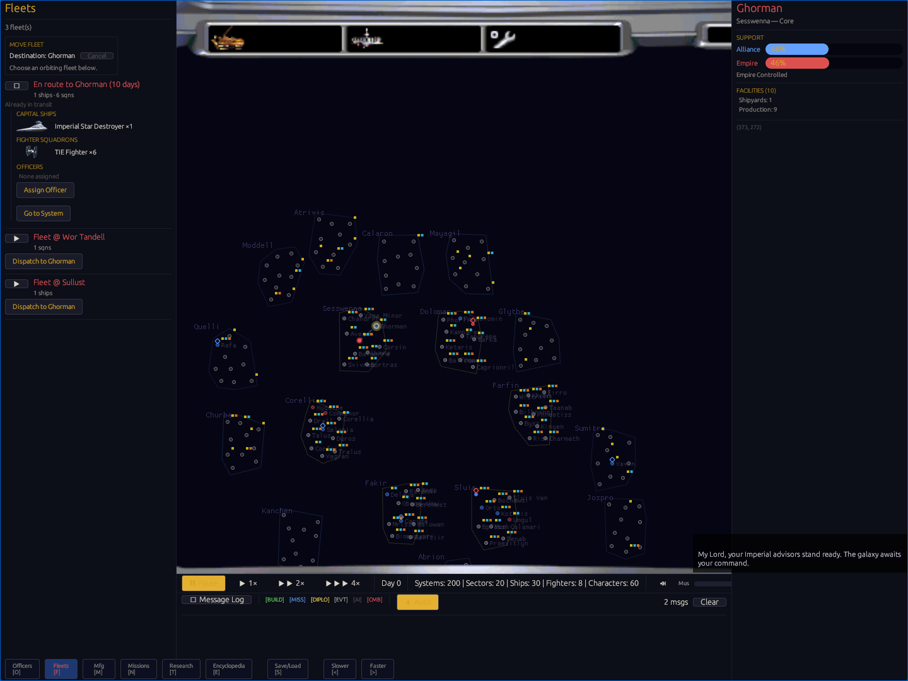

# F-007C Player Fleet Dispatch Evidence

F-007C connects the ordinary player fleet panel to the same authoritative
departure path used by the simulation. A player can choose a destination from
the galaxy context menu, dispatch one eligible orbiting fleet, and see that
fleet leave its origin and report its destination and remaining travel time.
F-007 remains open for transit balance, system-level combat distribution, and
victory.

## Implemented path

- `validate_fleet_dispatch` rejects missing fleets or systems, destroyed
  destinations, the wrong faction, fleets already in transit, the current
  location, and empty fleets without mutating state.
- `begin_faction_fleet_transit` calculates configured travel time and delegates
  to the authoritative departure helper, which removes the fleet from its
  origin orbit index.
- The system context menu opens the fleet panel with a destination banner.
  Eligible fleets expose `Dispatch to <system>` while invalid rows explain why
  they cannot move.
- Transit rows display `En route to <system> (<days> days)` above composition,
  so the destination and countdown do not overlap ship or squadron counts.
- An open egui context menu owns its left click before the galaxy map handles
  selection. Missing fleet or system targets are discarded before this gate,
  preventing invisible stale menus after arrival consolidation.
- Accepted native departures emit the existing movement message, departure
  effect, and faction voice. Rejections report the validation result and do not
  announce a false departure. Browser acceptance kept music muted.

## Verification

| Gate | Result |
|------|--------|
| Workspace unit and integration tests | 533 passed, 0 failed, 4 intentionally ignored |
| Documentation tests | 3 passed, 0 failed, 16 intentionally ignored |
| Focused render suite | 83 passed, including open-menu ownership and stale-target release |
| Focused movement suite | 25 passed, including dispatch validation and authoritative departure assertions |
| Independent dispatch harness | 13 checks passed for validation, state preservation, both factions, repeat prevention, and arrival-merge invalidation |
| Native/WASM replay | 9/9 checkpoints, final `v1:b8a40a56246c1314`, 4 requests, 0 browser errors |
| Packaged WASM | 4,956,299 bytes, SHA-256 `5cf3c3b107ab1e54d3914cab85bbe2a52638bee80baa680f232153a25aa854f4` |
| Runtime pack | 29,096,058 bytes, SHA-256 `6123deec14cfbfd070573c7001ef1123bd52067273498ad0c36cb7fdb108f509` |

The final GPT-6 Astra review ran through `codex-orchestrator` at medium effort.
It found no P0, P1, P2, or P3 issue in the final artifact.

| Browser assertion | Alliance | Empire |
|-------------------|----------|--------|
| Dispatch | Yavin to Geedon V | Coruscant to Ghorman |
| Eligible composition | 1 Corellian Corvette | 1 Imperial Star Destroyer and 6 TIE squadrons |
| Destination banner and origin removal | Pass | Pass |
| Countdown | 10 to 9 days | 10 to 9 days |
| Repeat prevention | `Already in transit` | `Already in transit` |
| Correct faction roster | 4 fleets | 3 fleets |
| Separate transit and composition rows | Pass at the default 280-pixel panel width | Pass at the default 280-pixel panel width |
| Bitmap cockpit, galaxy, and ship art | Pass | Pass |
| Startup requests | 4/4 HTTP 200 | 4/4 HTTP 200 |
| Console, page, network, missing-asset errors | 0, 0, 0, 0 | 0, 0, 0, 0 |

Chromium emitted four `ReadPixels` performance warnings per faction while
capturing screenshots. They were not runtime errors and did not affect play.

## Audit history

The first Astra pass exposed an input-ordering defect: a normal left click on
`Move Fleet Here` reached the map before egui and closed the menu. The map now
defers left-click selection while a context menu owns the pointer. The second
pass proved dispatch for both factions and found two remaining presentation
edges, stale removed-fleet menu state and overlapping Empire transit text.
Both were corrected before the final clean pass.

## Remaining M1 gates

This evidence closes ordinary player dispatch, not all movement or simulation
parity. M1 still requires lower steady-state transit, system-level combat
resolution with broader battle distribution, verified Death Star and victory
outcomes, and five-seed native/WASM checkpoint equivalence.
