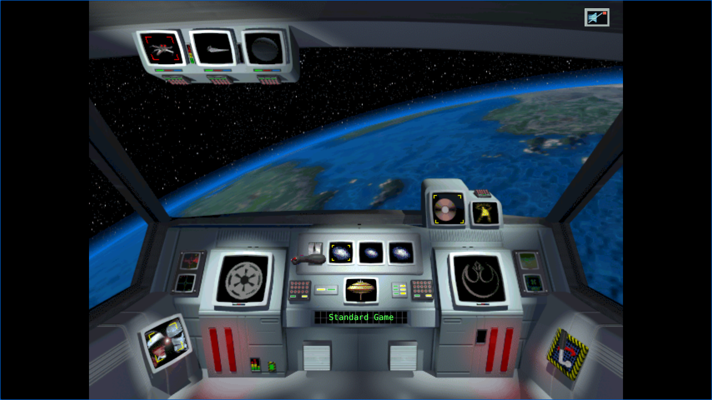

# F-007D System Combat Resolution Evidence

F-007D removes the system combat backlog. One trigger now resolves every
hostile task force orbiting that system as one bounded engagement, applies each
round before the next, and emits one aggregate combat event. It does not claim
that campaign balance or victory pacing is complete. Those remain F-007E.

## Corrected invariants

- Every Alliance and Empire fleet in the system enters the same deterministic
  resolution scope. Destroying one fleet advances to the next opposing pair.
- Up to 256 rounds run without an intervening repair tick. A round with no hull
  or fighter change stops immediately.
- An unchanged stalemate is not reopened every five ticks. Arrival or completed
  manufacturing clears the cooldown because system composition has changed.
- Fighter losses are written back to fleet rosters before empty fleets are
  removed.
- System-based fighter wings can launch without a carrier. A fleet that loses
  its carrier during combat does not acquire that exception.
- Fighter attack uses the DAT aggregate attack rating, strikes the current
  shield pool, and no longer treats shield recharge as an absorption percentage.
- Capital-ship laser cannons screen fighters. Opposed fighter wings take at
  least one squadron of bounded attrition, preventing integer-rounding loops.
- Ship-damage events compare against the actual pre-round hull. Previously,
  already damaged ships could report false progress against maximum hull.

## Reproduced defect and result

After F-007B, seed 42 reported 603 space-combat events in 5,000 ticks. Of those,
602 were five-tick draws at Xyquine. The loop combined four defects: only the
first opposing pair entered each trigger, fighter losses were not applied,
fighter-only fleets could not launch, and shield recharge was interpreted as
percentage absorption. Repair ticks then healed the small hull changes between
attempts.

With F-007D, the same campaign produces two decisive system engagements:

| Tick | System | Winner | Rounds | Repeat backlog |
|---:|---|---|---:|---|
| 17 | Praesitlyn | Empire | 1 | No |
| 1,991 | Xyquine | Empire | 33 | No |

Xyquine begins with five Alliance capital ships and one fighter squadron
against 153 Empire fighter squadrons. It ends once with the Alliance force
destroyed and 152 Empire squadrons remaining.

## Five-seed diagnostic

All five 5,000-tick dual-AI runs completed without a panic. No system returned
to the old permanent five-tick combat loop.

| Seed | Final fleets | Transit | Space engagements | Systems | Alliance systems | Empire systems | Victory |
|---:|---:|---:|---:|---:|---:|---:|---|
| 7 | 4 | 4 | 1 | 1 | 1 | 9 | No |
| 42 | 6 | 6 | 2 | 2 | 2 | 5 | No |
| 99 | 4 | 4 | 0 | 0 | 3 | 5 | No |
| 1,337 | 106 | 105 | 2 | 2 | 2 | 6 | No |
| 424,242 | 76 | 0 | 6 | 2 | 0 | 6 | No |

This diagnostic exposes the next independent defect instead of hiding it.
Campaign encounters now range from zero to six, far below the M1 target of
50-400 across at least eight systems. Seeds 1,337 and 424,242 also violate the
fleet-arena bound after one faction becomes ineffective. Seed 424,242 reaches
zero Alliance-controlled systems without emitting formal victory and records
192,902 `ship_repair_started` events for 163 completed repairs. F-007E therefore
owns AI target balance, transit fan-in, victory reachability, repair telemetry,
and the remaining `TroopClassDef` fallback.

## Verification

| Gate | Result |
|---|---|
| Core combat tests | 40 passed |
| Data combat-application tests | 4 passed |
| Simulation stalemate regression | Passed |
| Workspace unit and integration tests | 541 passed, 0 failed, 4 intentionally ignored |
| Documentation tests | 3 passed, 0 failed; existing ignored examples retained |
| Original-data replay manifest | 2 passed |
| Native/WASM replay | 9/9 checkpoints; final `v1:b8a40a56246c1314` at tick 25 |
| Browser replay failures | Invalid query closed at `query`; missing pack closed at `runtime_pack_fetch` |
| Normal browser startup | 4 HTTP 200 requests; semantic menu active; zero browser errors |
| Packaged WASM | 4,965,795 bytes; SHA-256 `3428ab31a8950dfb58cd83cd873635ccf9f2cfa983f35ea4d34a89e314a91fb0` |
| Runtime pack | 29,096,058 bytes; SHA-256 `6123deec14cfbfd070573c7001ef1123bd52067273498ad0c36cb7fdb108f509` |

GPT-6 Astra reviewed this tranche through `codex-orchestrator` at medium
effort. A fresh browser completed replay in about 432 ms and activated the menu
in about 482 ms. The agent-browser Chrome build instantiated WASM but suppressed
animation frames, so the gate now drives the exported macroquad frame only until
the report or menu becomes ready. Both paths load 52 game-data files, 2,231
bitmaps, and five audio files through exactly four successful requests. Music
remained muted, and no page, network, or application runtime error occurred.

## Remaining scope

F-007D verifies the headless system resolver. Interactive auto-resolve still
enters the app's single-pair path, while tactical combat has separate state and
application behavior. Their convergence remains M2. Exact per-arc weapon and
anti-fighter formulas remain P23 parity work. F-007E is next and must pass the
campaign-distribution, transit, repair, and victory gates before M1 can close.
